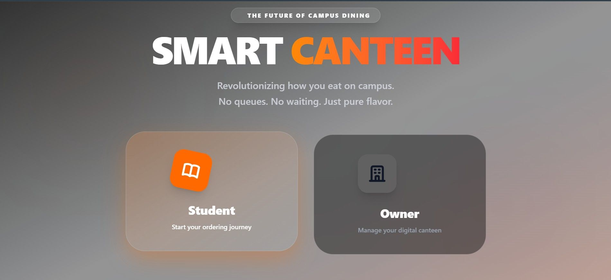
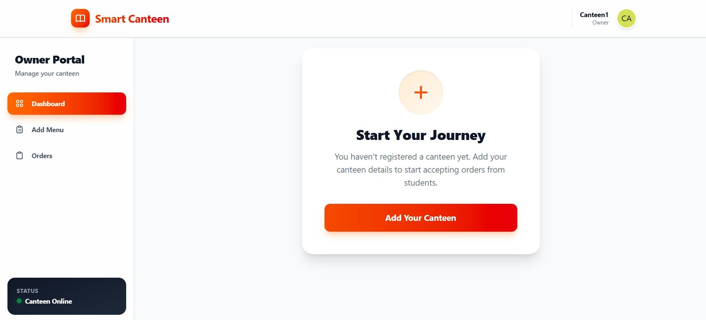
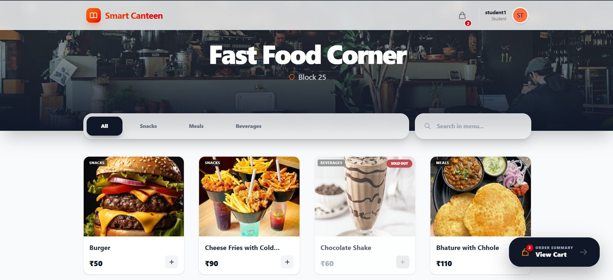
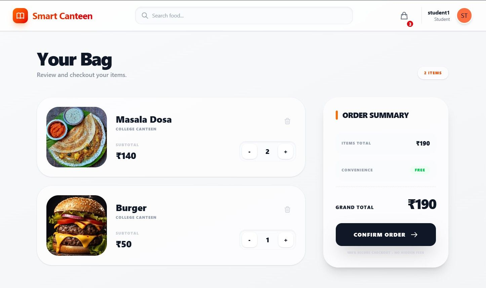
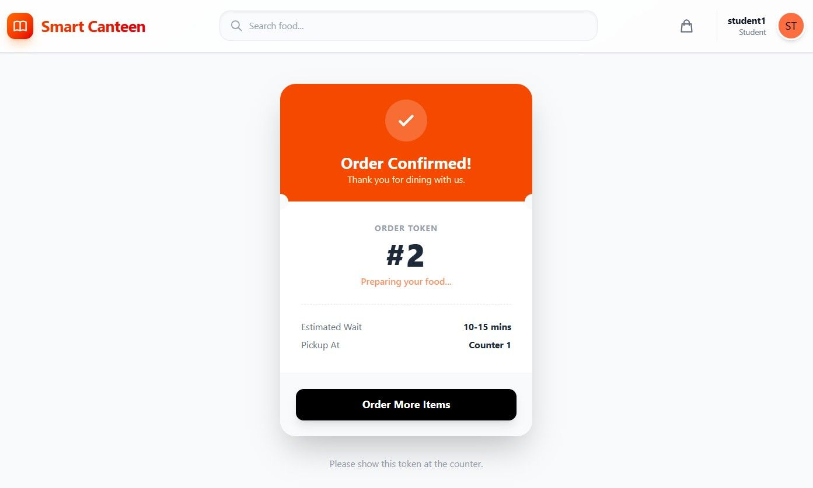
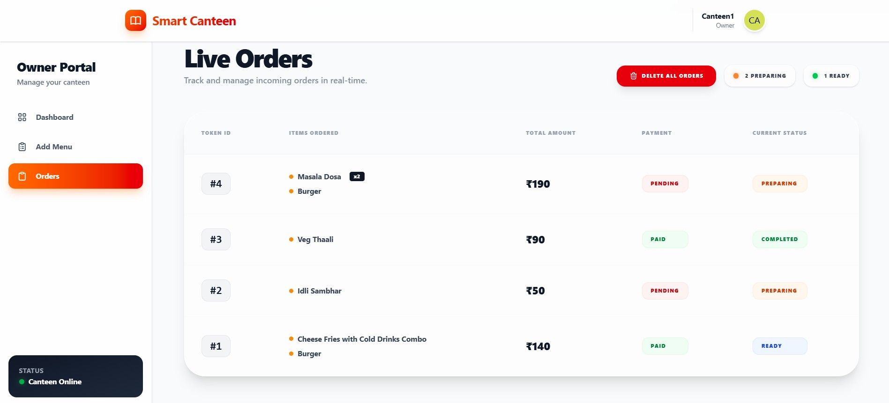
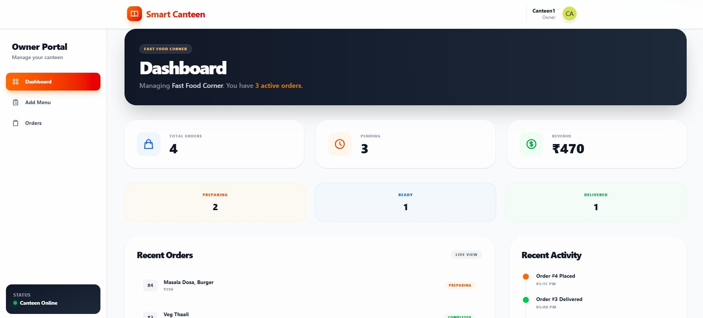

<h1 align="center">🍔 Online Food Ordering System</h1>

<p align="center">
A full-stack MERN application that allows users to browse canteens, explore menus, and order food online with secure payment integration.
</p>

<p align="center">
<a href="https://online-food-ordering-system-dusky.vercel.app"><strong>🌐 Demo Link</strong></a> •
<a href="https://github.com/tanya-92/online-food-ordering-system"><strong>📂 Repository</strong></a>
</p>

---

## 🚀 Features

✨ User authentication with JWT  
✨ Browse canteens and food menus  
✨ Add food items to cart 
✨ Admin dashboard to manage canteens & orders  
✨ Image upload for canteens / food items  
✨ Responsive design for mobile & desktop  

---

## 🛠️ Tech Stack

**Frontend**
- React.js
- Tailwind CSS
- Axios

**Backend**
- Node.js
- Express.js

**Database**
- MongoDB (Mongoose)

**Authentication**
- JWT (JSON Web Token)

---

## 👥 User Roles

| Role | Description | Permissions |
|-----|-------------|-------------|
| 👤 User | Regular user who wants to order food | Browse canteens, view menus, add items to cart, place orders, make payments |
| 🏪 Canteen Owner | Owner who manages their canteen and food items | Add/update food items, manage menu, view incoming orders |
| 🛠 Admin | Platform administrator | Manage users, manage canteens, view all orders, control platform activities |

---

## 📸 Screenshots

### 🏠 Landing Page


### 🍽️ Canteen Owner Dashboard


### 🛒 Add Menu Page


### ⚙️ Student Dashboard


### ⚙️ Cart


### ⚙️ Confirm Order


### ⚙️ Live Orders


### ⚙️ Canteen Owner Dashboard


---

## ⚙️ Installation & Setup

Clone the repository

```bash
git clone https://github.com/yourusername/online-food-ordering-system.git
